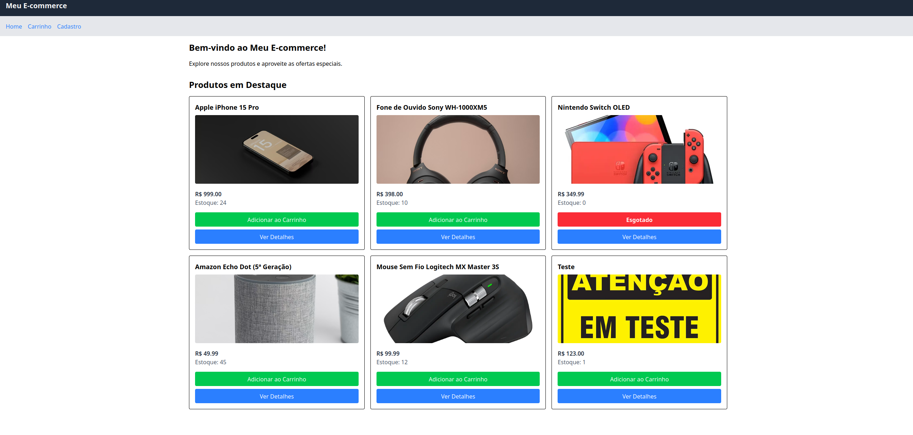
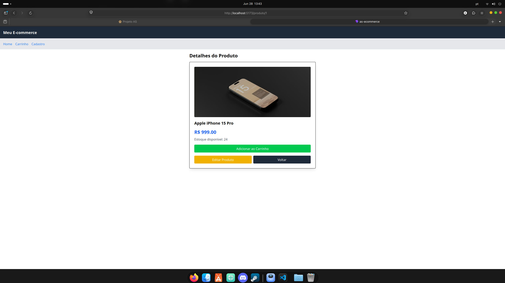
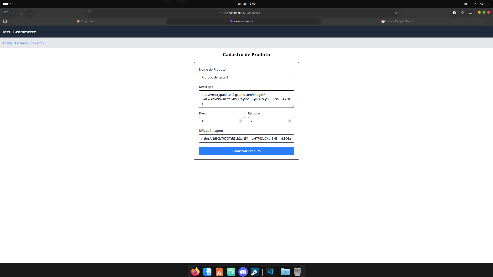
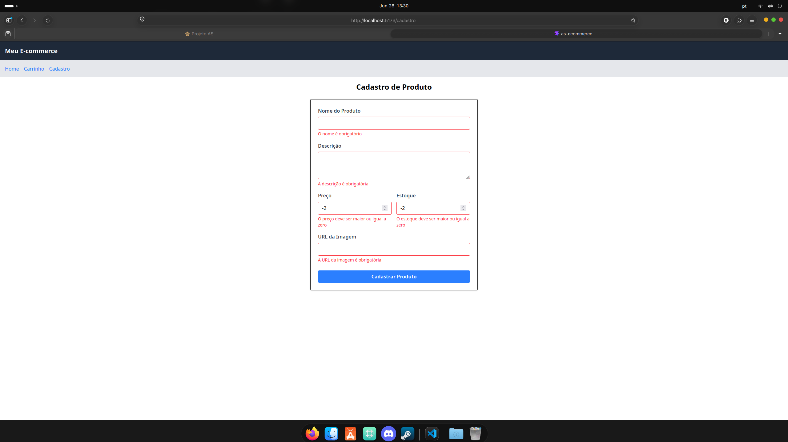
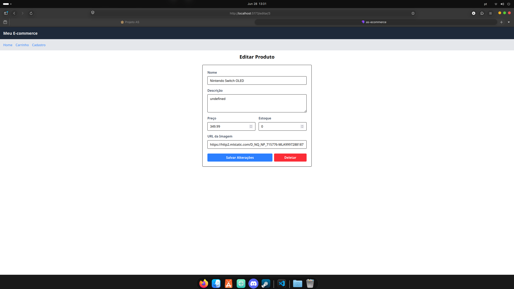
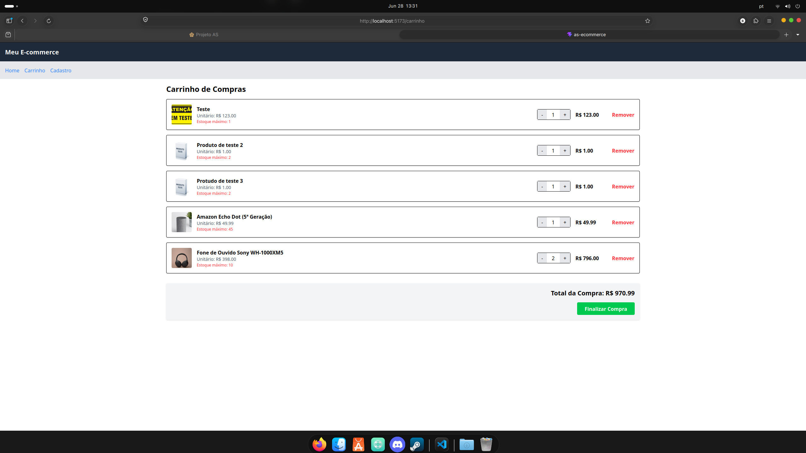
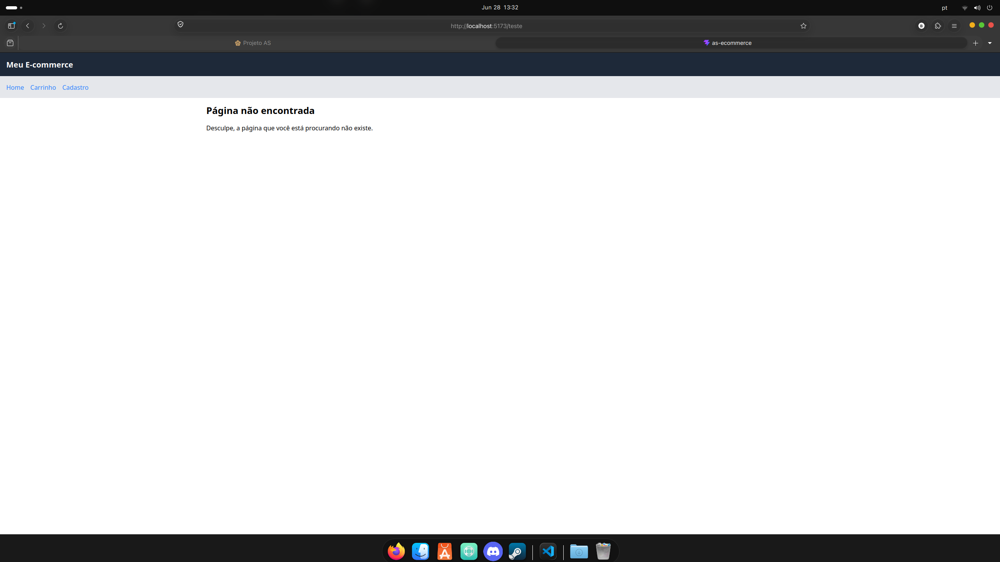

# Avaliação Prática AS - Mini E-commerce React

## 1. Estrutura Geral do Projeto
Organizei o projeto dentro da pasta `src` dividindo as responsabilidades da seguinte forma:
* **`/components`**: Componentes visuais que se repetem, como o `Header` e o `Card` de produto.
* **`/context`**: Onde fica o `CartContext.jsx`, que gerencia o estado global do carrinho.
* **`/pages`**: As páginas principais do sistema (Home, Cart, Details, Register, Edit e NotFound).

Para a navegação, usei o `react-router-dom`. O fluxo permite ir da lista de produtos para os detalhes (`/produto/:id`), acessar o carrinho (`/carrinho`), ou ir para as telas de cadastro/edição. Também adicionei uma rota curinga (`*`) para a página 404.

## 2. Gerenciamento de Estado (useContext)
Criei o `CartContext` para evitar o prop drilling e facilitar o acesso aos dados do carrinho de compras.
* **O que ele guarda:** Um array com os itens adicionados (`cart`) e o valor total numérico da compra (`cartTotal`).
* **Como funciona:** O contexto tem as funções de adicionar, remover e alterar a quantidade dos itens. É nele que faço a verificação para não deixar o usuário colocar mais itens no carrinho do que o estoque real permite.
* **Onde é consumido:** No `Card` (para calcular o estoque disponível e liberar ou bloquear o botão de compra) e na página `Cart` (para listar os itens e mostrar o valor total).

## 3. Consumo da API (JSON Server)
A base de dados é simulada pelo JSON Server rodando na porta 3001 (`http://localhost:3001/products`).
* **GET:** Usado na Home para listar tudo e nas páginas de Detalhes e Edição para puxar as informações de um produto específico.
* **POST:** Usado no formulário de Cadastro para salvar um novo produto.
* **PUT:** Usado no formulário de Edição para atualizar os dados.
* **DELETE:** Usado na tela de edição para excluir um produto.

As requisições foram feitas utilizando a API nativa `fetch` dentro de hooks `useEffect`.

## 4. Funcionalidades e Regras de Negócio
* **CRUD Completo:** É possível listar, criar, editar e excluir produtos.
* **Controle de Estoque:** Se o estoque na API for 0, o componente já renderiza a tag "Esgotado". Se o usuário tentar adicionar itens no carrinho além do limite, o sistema bloqueia a ação.
* **Validações de Formulário:** Não é possível cadastrar produtos com preço ou estoque negativo, nem deixar campos em branco. Caso o usuário erre na validação, usei o hook `useRef` para jogar o foco (cursor) automaticamente no input que precisa ser corrigido.

## 5. Como Rodar o Projeto
1. Instale as dependências com `npm install`
2. Rode o backend falso (JSON Server) em um terminal: `npx json-server --watch db.json --port 3001`
3. Em outro terminal, rode o frontend: `npm run dev`

---

## 6. Screenshots do Sistema

**Tela inicial (Home)**

**Detalhes do Produto**

**Cadastro Válido**

**Cadastro com Erro**

**Edição de Produto**

**Carrinho de Compras**

**Limite de Estoque**

**Página 404**
